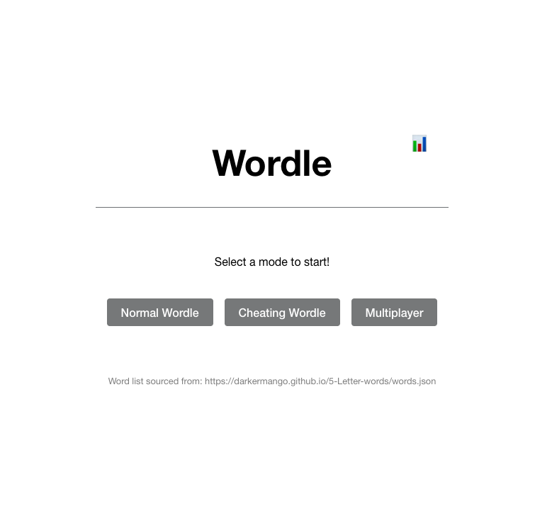
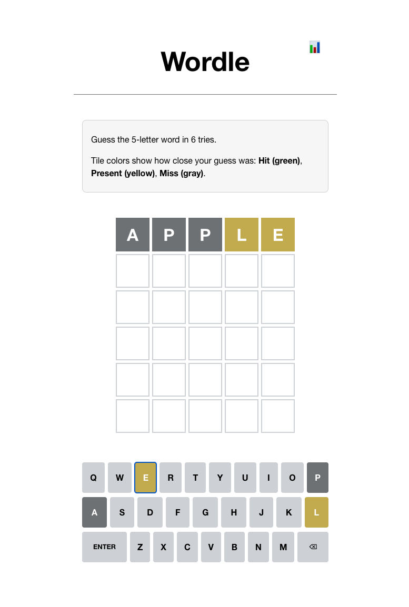
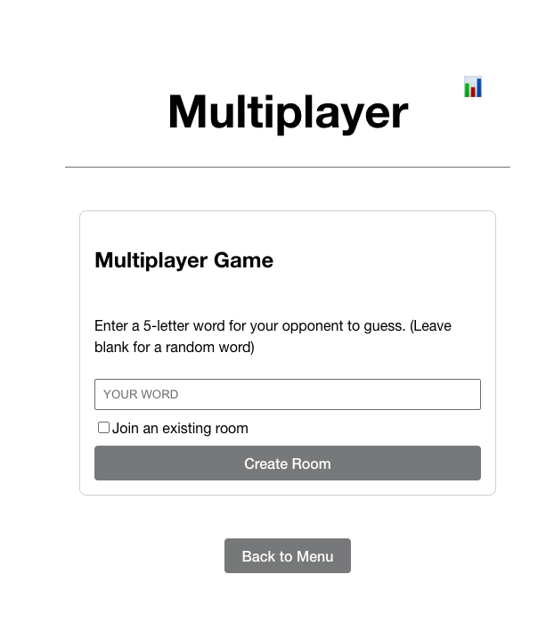
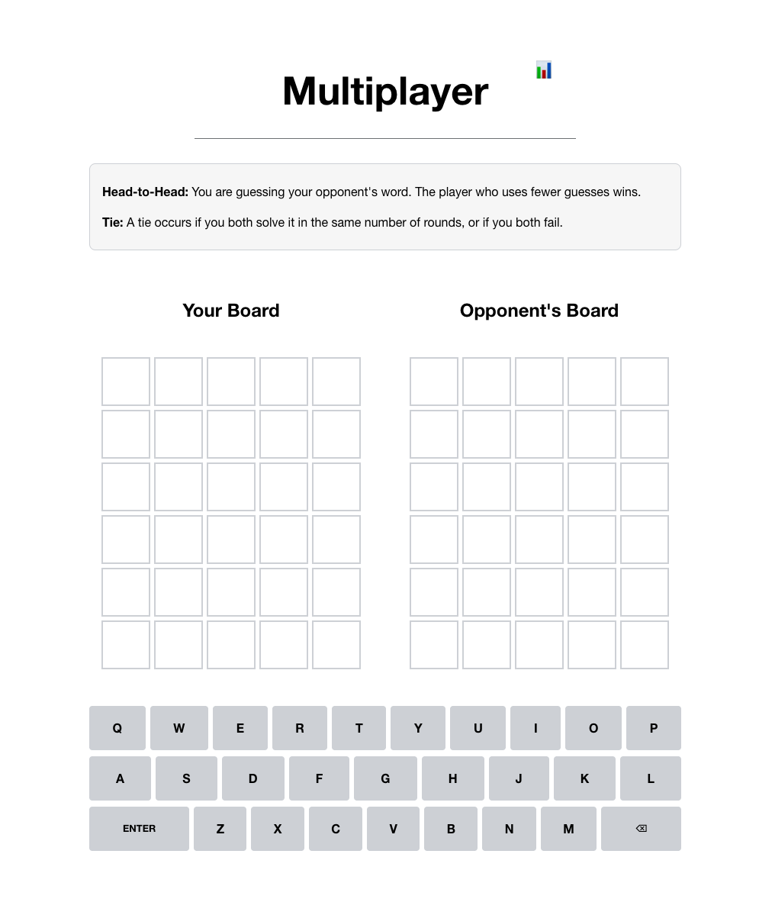
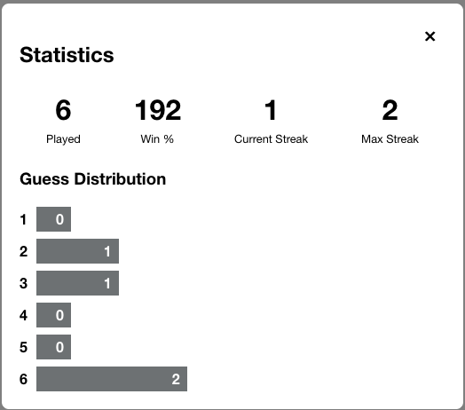

# Wordle Game Project

This project is a modern, full-stack implementation of the popular word-guessing game Wordle, built with a client-server architecture and extended with advanced features like a "cheating" host mode and a real-time multiplayer mode.

## Features Implemented

-   [x] **Task 1: Normal Wordle:** Core single-player game logic.
-   [x] **Task 2: Server/Client Wordle:** The application is structured as a React front-end client and an Express back-end server, with game logic and answer validation handled securely on the server.
-   [x] **Task 3: Host Cheating Wordle:** An "Absurdle" style mode where the host actively tries to make the game harder by maintaining a list of possible answers instead of choosing one at the start.
-   [x] **Task 4: Multi-player Wordle:** A real-time multiplayer mode using WebSockets, supporting various competitive scenarios.
-   [x] **Bonus: Player Statistics:** A high-score and statistics tracking feature that persists data in the browser's `localStorage`.
-   [x] **Bonus: On-Screen Keyboard:** A color-coded, interactive on-screen keyboard for improved usability and mobile-friendliness.

---
## Getting Started

### Prerequisites

-   Node.js (v22.12.0 or later recommended)
-   npm (v10.9.0 or later for workspace support)

### Installation

1.  Clone the repository.
2.  Navigate to the root directory of the project.
3.  Install all dependencies for both the client and server using the npm workspace command:
    ```bash
    npm install
    ```

### Running the Application

Run the following command from the root directory to start both the front-end and back-end development servers concurrently using Turbo:

```bash
npm run dev
```

-   The API server will be available at `http://localhost:3001`.
-   The React web client will be available at `http://localhost:5173` (or another port if 5173 is in use).

Open your browser to the web client's address to play the game.

---

## Tech Stack

-   **Frontend:** React, TypeScript, Vite
-   **Backend:** Node.js, Express, TypeScript
-   **Real-time Communication:** WebSockets (`ws` library)
-   **Monorepo Management:** npm Workspaces, Turbo

---

## Project Structure

The project is organized as a monorepo to facilitate code sharing and streamlined development between the client and server.

```bash
/
├── apps/
│   ├── api/      # Backend Express server and WebSocket logic
│   └── web/      # Frontend React client application
├── package.json  # Root configuration for npm workspaces and turbo
...
```

-   `apps/api`: Contains all server-side logic, including the Express REST API for game management and the WebSocket server for real-time multiplayer communication. [details for the api](app/api/README.md).
-   `apps/web`: Contains the complete React front-end, including all components, services, and styling. [details for the web](app/web/README.md).

---

## Game Modes & Features Explained

### Single Player

#### Normal Mode
This is the classic Wordle experience. The server selects a random 5-letter word, and the player has six attempts to guess it.

#### Cheating (Absurdle) Mode
In this mode, the server does not pick a single answer at the start. Instead, after each guess, it analyzes the entire word list and chooses the outcome pattern that leaves the largest possible set of remaining words. This makes the game significantly more challenging by providing the player with the least amount of information possible.

### Multiplayer

The multiplayer mode uses WebSockets for real-time interaction. From the multiplayer menu, a player can either create a new room or join an existing one.

#### Game Setup Logic
The game mode is dynamically determined based on whether the players provide a challenge word:

1.  **Head-to-Head (Both players provide a word):** Each player attempts to guess the word provided by their opponent.
2.  **Race Mode (Neither player provides a word):** Both players are given the *same* randomly selected word from the server and race to solve it first.
3.  **Hybrid Mode (One player provides a word):** The player who provided a word gets a random word to guess, while the player who did not must guess the word that was provided.

#### Win/Loss/Tie Conditions

-   **Race Mode:**
    -   **Win:** Be the first player to correctly guess the shared word. The game ends for both players immediately.
    -   **Tie:** Both players fail to guess the word within 6 tries.

-   **Head-to-Head Mode:**
    -   **Win:** Guess your word in fewer attempts than your opponent.
    -   **Loss:** Your opponent guesses their word in fewer attempts than you, or you fail to guess the word and your opponent succeeds.
    -   **Tie:** Both players guess the word in the same number of attempts, or both players fail to guess their word.

### Bonus Features Implemented

#### 1. Player Statistics & High Scores
-   **Description:** The application tracks and persists single-player game statistics (Games Played, Win %, Streaks, Guess Distribution) in the browser's `localStorage`.
-   **Benefit:** This adds significant replay value and a sense of progression for the player. A stats icon (📊) in the header allows players to view their progress at any time, and the modal automatically appears after a game to provide immediate feedback.

#### 2. On-Screen Keyboard
-   **Description:** An interactive, color-coded virtual keyboard is displayed below the game board. Keys change color to reflect their status (`hit`, `present`, `miss`) based on all previous guesses.
-   **Benefit:** This provides a massive quality-of-life improvement by offloading the mental task of tracking used letters. It also makes the game fully accessible and playable on mobile/touch devices.

---

## Design Decisions & Trade-offs

1.  **Real-time Communication (WebSockets vs. HTTP Polling):**
    -   **Decision:** WebSockets were chosen for the multiplayer mode.
    -   **Trade-off:** While this increases server-side complexity for managing persistent connections and stateful rooms, it provides a superior, low-latency, real-time user experience. The alternative, HTTP polling, would have been simpler to implement but would have resulted in noticeable lag and a poor competitive feel.

2.  **State Management (In-Memory vs. Database):**
    -   **Decision:** All game sessions (both single-player and multiplayer) are stored in-memory on the server in `Map` objects.
    -   **Trade-off:** This approach is simple, fast, and avoids external dependencies, making it ideal for the scope of this project. The significant drawback is the lack of persistence; if the server restarts, all active games are lost. For a production application, a more robust solution like Redis would be a logical next step to ensure game state durability.

3.  **Code Organization (Monorepo):**
    -   **Decision:** The project is structured as a monorepo using npm workspaces.
    -   **Trade-off & Future Improvement:** While the monorepo simplifies development, there is currently type definition duplication between the `api` and `web` projects. The ideal next step, and a key architectural improvement, would be to create a shared `packages/types` package. This would establish a single source of truth for the data contract between the client and server, eliminate redundant code, and allow TypeScript to catch integration errors at compile time.

---

## Future Enhancements (Bonus Ideas)

### 1. Tile Flip & Reveal Animation
-   **Description:** When a player submits a guess, the tiles for that row would perform a 3D flip animation, one by one, with a slight delay between each tile. The tile's color (`hit`, `present`, or `miss`) would be revealed at the halfway point of the flip.
-   **Benefit:** This is a high-impact UI enhancement that creates suspense and makes the game feel significantly more polished and dynamic, mimicking the signature experience of the original Wordle.

### 2. Multiplayer Disconnection Handling
-   **Description:** If a player disconnects during a match (e.g., by closing their browser), the server would detect the WebSocket `close` event and immediately notify the remaining player. The opponent's board would update to show a "Disconnected" status, and the remaining player would be declared the winner by forfeit.
-   **Benefit:** This feature would make the multiplayer mode more robust by gracefully handling a common real-world scenario. It prevents players from being stuck in a broken game and provides clear, immediate feedback, reducing user frustration.

---

## Screenshots

### Main Menu
*Allows players to choose between Single Player and Multiplayer modes.*



### Single-Player Game
*The classic Wordle experience with an interactive on-screen keyboard.*



### Multiplayer Lobby
*A clean, unified interface for creating or joining a multiplayer room.*




### Multiplayer Gameplay
*A side-by-side view of your board and your opponent's board during a match.*



### Player Statistics
*A modal displaying persistent player stats, including win percentage and guess distribution.*



---

## Attribution

The 5-letter word list used in this project is sourced from: `https://darkermango.github.io/5-Letter-words/words.json`